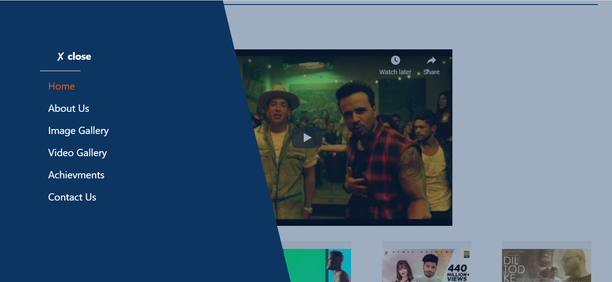
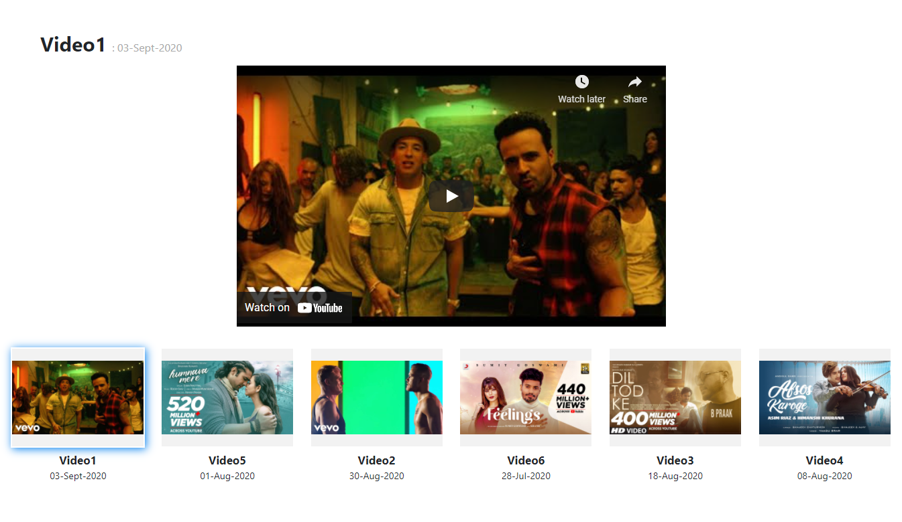

# School-AngularNodeJS
It is an angular website for school with a lots of animation and views

#### Webpage in Action _<a href="https://lko-school.herokuapp.com/">click here</a>_

# Features
It has a lot of scroll and hover animations.
 It has gallery section and video section attached with youtube.
 It has nice animated navigation drawer.

# Routes/Pages

### Home Page
> 

### About Page
> 

### Gallery Page
> 

### Footer Section
> 

### Drawer Section
> 

### Video Page
> 

# Dependencies/API's used
> <a href="https://michalsnik.github.io/aos/">AOS Library</a>
>   <a href="https://www.npmjs.com/package/ngx-gallery-9">NGX-Gallery 9</a>
>   <a href="https://www.npmjs.com/package/@angular/youtube-player">YouTube Player</a>
